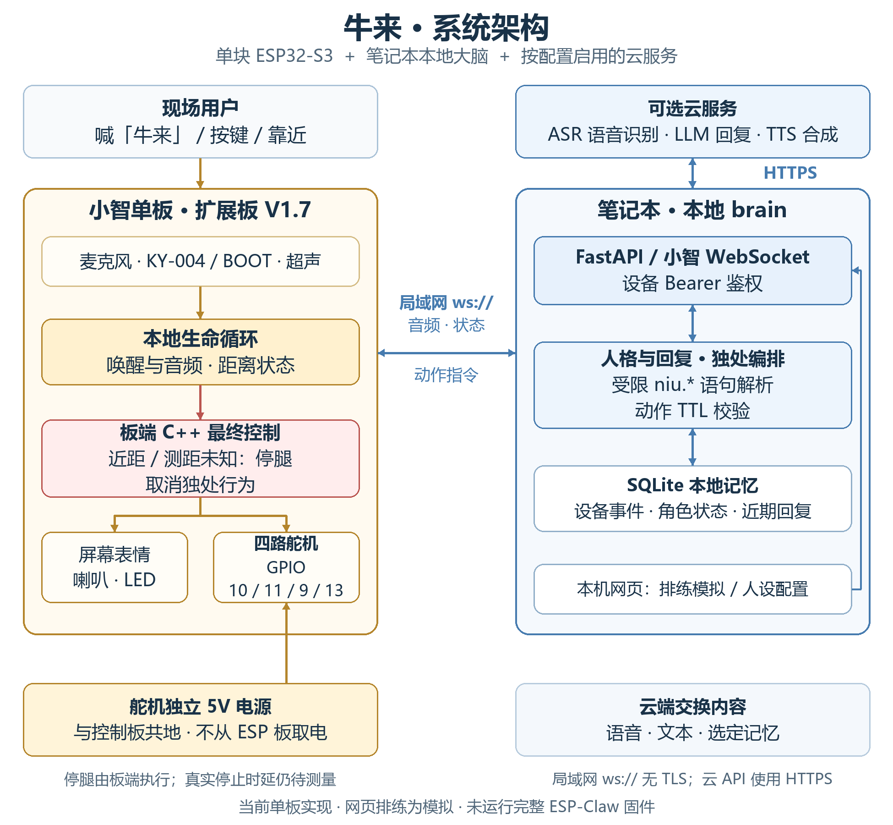
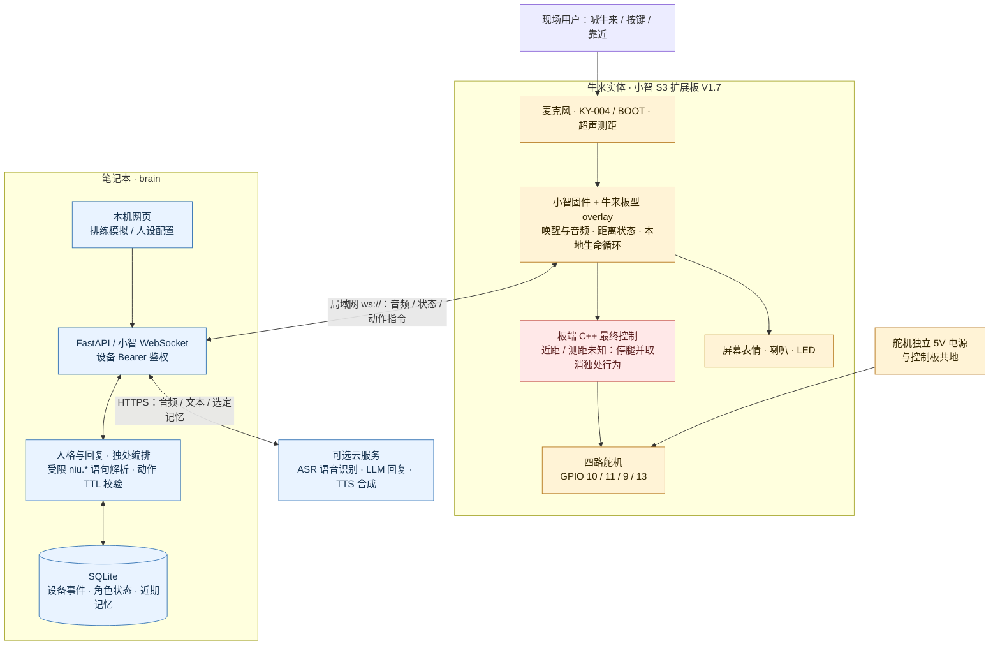

# 牛来 / ox-robot

有人靠近时它先停着等人喊；喊「牛来」先播电影「妈妈」片段，再礼貌听、想、说。人离开后，它才过自己的生活。

一块小智 S3 扩展板 V1.7 负责听、说、屏、灯、键、超声和四路舵机信号。笔记本上的 `brain/` 负责人格、记忆和动作编排。不把完整 ESP-Claw 固件并进小智。

- 仓库：https://github.com/23xxCh/ox-robot
- 最终汇报：[PDF](./outputs/submission-2026-09-06/牛来-最终汇报.pdf) · [Word](./outputs/submission-2026-09-06/牛来-最终汇报.docx)
- Checkpoint 1：[牛来机器人-进展说明-2026-09-05.md](./牛来机器人-进展说明-2026-09-05.md)
- Checkpoint 2：[牛来机器人-Checkpoint2-进展说明-2026-09-06.md](./牛来机器人-Checkpoint2-进展说明-2026-09-06.md)
- Submission：[牛来机器人-Submission-2026-09-06.md](./牛来机器人-Submission-2026-09-06.md)

## 架构

当前实现：**一块小智 ESP32-S3 板 + 笔记本本地大脑 + 按配置启用的云语音/模型服务**。



<details>
<summary>查看可编辑的 Mermaid 架构图</summary>



</details>

- **物理控制在板端：** 连续有效远距约 8 秒才进入独处；近距或未知时优先停腿、取消独处吐槽，明确发起的礼貌会话另行处理。实际停止与静音时延仍待测。
- **语音需要按路径说明：** 本地「妈妈」片段在设备播放；完整问答依赖笔记本与配置的语音/模型服务。当前局域网使用 `ws://`，没有 TLS；网页排练结果是模拟。
- **实现边界：** 本轮未运行完整 ESP-Claw 固件；`niu.*` 是 Python 受限语句解析器，不是完整 Lua 运行时。舵机外供 5V，不从 ESP 板取电；继电器未使用。

## 仓库

| 路径 | 内容 |
|---|---|
| `brain/` | 本地大脑（FastAPI、测例、排练页） |
| `firmware/xiaozhi-niulai/` | 小智板型 overlay、`mama.ogg`、接线说明 |
| `firmware/niulai-*-test/` | 屏/喇叭、超声、四足 Arduino 测试 |
| `mechanical/` | 开框 / BOM 件 / 外壳接口 |
| `docs/` | 架构、PRD、SPEC |
| `outputs/牛来机器人-A2L打印包-v0.5/` | 打印包 |

## 接线

屏已经占用 **GPIO 21（SCL）** 和 **GPIO 47（MOSI）**。灯和键不能接这两脚，否则花屏。

| 功能 | GPIO | 说明 |
|---|---|---|
| 屏 ST7789 2" | 21 / 47 / 45 / 40 / 41 / 42 | SCL / MOSI / RST / DC / CS / BL |
| 喇叭 MAX98357 | 15 / 16 / 7 | BCLK / LRC / DIN |
| 麦 | 4 / 5 / 6 | WS / SCK / DIN |
| 超声 HC-SR04 | 8 / 17 | TRIG / ECHO |
| 舵机 SG90 ×4 | 10 / 11 / **9** / 13 | **5V 外供**；左后不要接 GPIO 12（充电指示） |
| KY-016 灯 S | **14** | 三针模块本轮只会红 |
| KY-004 键 S | **18** | 按下为低，开始礼貌听、想、说 |
| BOOT | 0 | 短按同样开始礼貌对话 |

KY-016：`-`=GND，中间=5V，`S`=14。  
KY-004：`-`=GND，中间 VCC 可空，`S`=18。  
舵机黄=信号、橙=外供 5V、棕=GND。一直转的那只，先确认黄线在 10 / 11 / 9 / 13，不要接到 12（充电指示）或 14 / 15 / 16 / 21。

## 固件

板型 `niulai-s3-expand-v17`，源码 overlay 在 `firmware/xiaozhi-niulai/`，构建在小智 `xiaozhi-esp32` 树里。

- 唤醒词：`niu lai`（单次「牛来」）
- 唤醒 / BOOT / KY-004：先 `PlaySound(OGG_MAMA)` 约 2.2 秒，再礼貌听、想、说，走私有大脑；立刻把四腿写回 1500 µs；不打开小智云
- 超声近距视为有人：腿立刻中位，打断 SECRET 吐槽，等人喊。礼貌对话里若让它动，可短促 `niu.walk`/`niu.turn`（ttl≤2000）；靠近仍冻腿
- SECRET：连笔记本私有 `ws://192.168.18.144:8000/xiaozhi/v1/`（2026-09-06 当前 WLAN），使用设备 Bearer 鉴权。LLM + `qwen3-tts-flash` Dylan，有冷却和安静间隔。拒绝 xiaozhi.me。断链时走已有本地片段回退，实际听感须真机验收。
- SECRET 步态：约 800 ms 随机步态，随后约 2 s 停在 1500 µs。360° 舵机不会一直转。喇叭音量 90

构建树：`E:\XIAOZHI_NATIVE\xiaozhi-esp32`。烧录前备份相关分区并确认接线与四腿悬空固定；服务故障本身不构成重刷固件的理由。靠近会请求 `ResetDecoder()`，实际静音时延待测。

```powershell
# ESP-IDF 6.0.2
Set-Location "E:\XIAOZHI_NATIVE\xiaozhi-esp32"
python scripts/build.py niulai-s3-expand-v17
idf.py -p COM6 flash
```

COM 口按设备管理器改。烧完先看黄牛脸，再按键或喊「牛来」。

## 本地大脑

```powershell
pip install -r brain/requirements.txt
python -m pytest
python -m brain.app
```

排练页：http://127.0.0.1:8000/  
人设页：http://127.0.0.1:8000/life （笔记本浏览器，不驱动真机冻结，也不连小智云）

设备连接必须提供 `Authorization: Bearer <NIULAI_DEVICE_TOKEN>`；三个 IM 入口必须提供独立的 `Authorization: Bearer <NIULAI_IM_TOKEN>`。在本机 `brain/.env` 或根 `.env` 配置，空值会拒绝连接；示例见 [.env.example](.env.example)。网页与 `/api/v1/*` 只对真实 localhost 开放。`python -m brain.app` 已禁用代理头；自行运行 uvicorn 时也要加 `--no-proxy-headers`。

微信 ClawBot（iLink，不是公众号）：`POST http://192.168.18.144:8000/im/clawbot/event`。
OpenClaw / 自建转发须附上上述 IM 入站 Bearer。出站另用本机环境变量 `NIULAI_CLAWBOT_TOKEN`（可选 `NIULAI_CLAWBOT_BASE_URL`），不能拿它充当入站鉴权。未配置出站 token 时只进测试发件箱，不假装已连上微信。人在场时微信只礼貌回、不走腿、不泄密。

无 `NIULAI_LLM_*` key 时测例仍应通过。90 秒路演只演板端，不演 /life 闲聊。

## 文档

| 文件 | 用途 |
|---|---|
| [牛来机器人-进展说明-2026-09-05.md](./牛来机器人-进展说明-2026-09-05.md) | Checkpoint 1 进展 |
| [牛来机器人-Checkpoint2-进展说明-2026-09-06.md](./牛来机器人-Checkpoint2-进展说明-2026-09-06.md) | Checkpoint 2 进展 |
| [牛来机器人-Submission-2026-09-06.md](./牛来机器人-Submission-2026-09-06.md) | 12:00 交卷稿 |
| [docs/architecture-niulai-local-brain-2026-09-05.md](./docs/architecture-niulai-local-brain-2026-09-05.md) | 当前软件架构 |
| [docs/prd-niulai-life-v2-2026-09-05.md](./docs/prd-niulai-life-v2-2026-09-05.md) | 生命感 PRD |
| [firmware/xiaozhi-niulai/README.md](./firmware/xiaozhi-niulai/README.md) | 板型与烧录 |

## 团队

陈熙贤（硬件）· 潘炜德（软件）· 微微（产品 & 商业）
