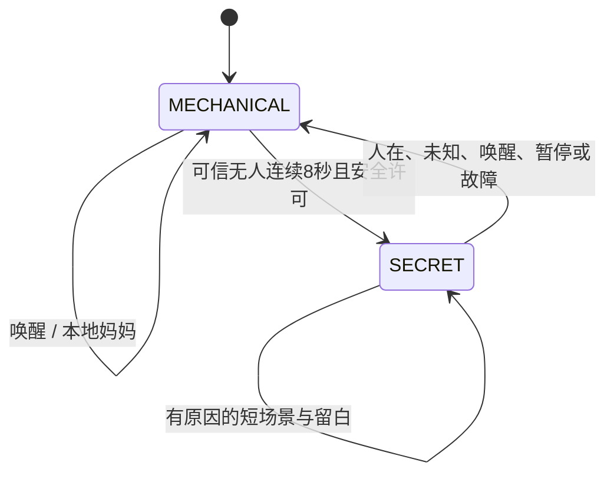

# 牛来 PRD v2：一只偷偷过自己生活的玩具

日期：2026-09-05｜状态：设计基线，待实现与真机验收｜范围：一只玩具、一个受控演示区。

配套文件：[架构与代码审查评分](review-niulai-architecture-2026-09-05.md) · [工程 SPEC](spec-niulai-life-v2-2026-09-05.md)。

## 1. 产品目标与本轮结论

牛来在人面前是一只机械玩具，喊它名字，它只回答“妈妈”。人离开后，它会先确认周围，再悄悄放松、做自己的小事、抱怨刚才的经历。人回来时，它立即收住声音和动作，重新装乖。下一次独处，它还记得刚才没做完的事。

要实现《玩具总动员》式生命感，重点是角色的动机、注意力、表演节奏和经历连续性。采用牛来自己的台词、声音和动作设计。技术服务于体验，不把是否采用 ESP-Claw、某个大模型或复杂机器人机构作为完成标准。

本轮交付是设计与审查文档。当前源码是 Python 模拟协议切片和三个 Arduino 外设测试，不能据此声称玩具已会说话、能可靠识人、会自主生活。本轮复测 10 项现有软件测试通过；真实音频、固件整合与整机效果仍待验证。

## 2. 基线与冲突处理

| 既有内容 | v2 决策 | 原因 |
|---|---|---|
| 08-31 的“有人装机械、无人恢复本性” | 保留，并固定“名字→妈妈” | 产品反差的核心 |
| 09-01 双板文档的 `PUBLIC_ALIVE`、回答妈妈后公开复活 | 从 v2 产品路径中取消 | 与“只有无人时才有灵魂”的故事相冲突 |
| 09-05 单块小智 S3＋笔记本大脑 | 沿用为首版路线 | 贴近现有代码，减少硬件整合工作 |
| 电脑管理人格、板端另做冻结 | 改为板端拥有最终人格与安全状态，电脑持有镜像 | 断网、迟到结果不能恢复秘密表演 |
| 飞书、微信、AI 写 Lua 驱动动作 | 延后到 P1 | 先完成本体生命感；外部入口不能绕过状态与权限 |
| 必须使用 ESP-Claw／完整双板 | 作为以后经测量再决定的方案 | 本轮用户明确允许不拘技术 |

本 PRD 与配套 SPEC 是后续开发的 v2 基线，历史文件保留供溯源。旧代码的状态名和行为不会因为文档更新而自动改变；迁移工作列在 SPEC。若范围再次变更，同步修改需求、协议与验收，不能只改提示词。

## 3. 首版用户、场地与成功条件

首版面向成年开发者、展台观众和喜欢角色玩具的体验者。在明确边界的室内演示区，由操作者照看一只固定放置的样机。儿童家庭长期使用和量产标准不属于本轮原型验收。

首版身体表现由眼神、头部或已验证关节、身体轻微姿态变化和声音组成。允许它自主“活动”，但先不要求位移行走。具体轴数以装配、限位和电源验证结果为准；未验证的腿部扫动不能直接装入外壳运行。需要真正四处走动时进入 P1 地面封闭区域验证。

体验成功需要同时满足：

1. 观众不听解说，也能看懂它“在人前装普通玩具，独处时有自己的性格”。
2. 至少三个自主小场景能在没有用户命令时发生；每个有原因、过程和收尾。
3. 声音、眼睛与身体表现同一个情绪，时间关系自然。
4. 人回来立即停止私密内容，断网时仍能演完核心故事。
5. 刚发生的事情会改变后续表现；它不编造没经历过的事情。

## 4. 牛来的角色设定

**性格：** 嘴硬、好奇、胆子小，珍惜被叫到名字，又嫌自己总得回答妈妈。抱怨针对处境和自己，不挖苦观众。

**小愿望：** 安安静静研究一点东西、找个舒服姿势、不让人发现自己很在意主人。

**矛盾：** 嘴上说“终于清静”，过一会又偷看人离开的方向。

**公开表演：** 同一段本地“妈妈”，音高和节奏稳定；没有尾随吐槽、自由回答或亲密动作。唤醒只触发固定回应，不改变人格。

**私下表演：** 短句、半句停顿、轻声自语、偶尔改口。知道自己刚经历了什么，允许不说话。不是每次动作都配一句台词，也不把每句话都写成笑话。

### 4.1 语气与声音标准

| 项目 | 设计要求 | 验收方式 |
|---|---|---|
| 机械语气 | “妈妈”约 0.4–0.9 秒，同一录音资源，无多余字 | 资源逐条试听；唤醒测试核对播放 ID |
| 私下语气 | 通常 6–24 个汉字、1–5 秒；句中允许 150–450 ms 的犹豫 | 录音／TTS 结果试听及时间标记 |
| 音色身份 | 同一个角色的两种表演，避免像换了个人 | 陌生人听辨与主观评分 |
| 情绪 | 好奇、松口气、心虚、想念、困倦五种可分辨表达；嘴硬贯穿整个角色 | 每类至少3段音频；10人盲听15段，150次分类正确率≥70%，每类≥60%；≥8/10人认为机械与私下声音属于同一角色 |
| 频率 | 正常独处最多 2 次主动发言／分钟；三分钟核心演出最多 4 次 | 从实际播放开始事件计数 |
| 连续性 | 最近 5 条不重复；资源不足则保持安静 | 固定种子与长时回放 |
| 台词来源 | 预录或提前生成并审核的原创素材优先；现场模型生成是增强 | 离线整场演出；资源清单与 hash |

数字是本轮提出的调优起点与验收目标，不是已有测量结果。音高、语速、气息效果以成品音频听感验收，不假定任意 TTS 服务都支持同一套控制参数。

## 5. 生命感如何发生

一个完整行为依次经历“注意到→想做→试探→行动→看反馈→收尾”。不是每段都要六个动作，但必须让观众看出前因后果。

| 层次 | 表现 | 边界 |
|---|---|---|
| 注意力 | 眼睛先看，头随后跟上 | 没有声源定位或视觉输入时不宣称知道声音／物体的位置 |
| 意图 | 对一个方向或上次未完成的小事感兴趣 | 目标只来自真实事件或明确的内部意图 |
| 犹豫 | 看一下、停一下、缩回一点，再决定 | 停顿仍可立即抢占，不能阻塞安全检查 |
| 情绪 | 被多次喊名字后有点不服气，久等后又在意 | 情绪逐渐变化，不因每条消息随机换人格 |
| 记忆 | 记住妈妈次数、上个片段、被打断的小目标 | 记录“想做”和“做成”两种事实，不能混为一谈 |
| 留白 | 发呆、休息、观察环境 | 安静也是可被选中的行为，不强制每隔几秒说话 |

微动作建议每 5–12 秒有一次机会；完整场景之间间隔 20–45 秒；可被情境或安静额度抑制。随机只用于已经合理的候选行为之间选择，不能替代动机。

## 6. 五个原创微场景

| ID／场景 | 触发与表演 | 记忆与退出 | 等级 |
|---|---|---|---|
| SC-01 妈妈名额 | 连续被叫三次，各机械回答“妈妈”；确认无人后左右看看，轻叹：“今天的妈妈名额用完了。”停一下，“算了，再叫还得答。” | 使用真实 `mama_count`；人回来立刻截断，未说完的抱怨保留为意图 | P0 |
| SC-02 舒服一点 | 独处时先斜眼看，再缓缓换一个已校准姿势，停 400–900 ms 观察；小声：“就这样，谁也别动我。” | 记住舒适姿态 ID；不要求轮子移动 | P0 |
| SC-03 刚才想到哪儿 | SC-02 或观察场景中被打断；再度确认无人后看向原方向：“刚才想到哪儿了……哦，对。” | 保存目标，不重播旧动作；重新检查条件再发起新片段 | P0 |
| SC-04 嘴硬地想你 | 独处初期“终于清静了”；约 60–120 秒后望向预设的离开方向：“怎么还不回来……我就随便问问。” | 一个剧情类型、两个≤8秒短片段；中间等待不占播放器；两次发声分别计额度；未确认方向时只环顾 | P0 |
| SC-05 上次碰壁 | 在具备地面运动及定位证据后，对刚遇过的障碍提前犹豫：“上次就是这儿，今天绕着点。” | 无位置可信度时只记“刚碰到东西”，不说“这儿”；清空记忆后不得引用 | P1 |

每个 P0 场景至少两个表演变体，采用 12–20 个审核私密语音片段构成首版素材包。SC-01/03 的关键剧情由确定性规则选择，不交给模型猜。

## 7. 用户旅程与人格合同

`MECHANICAL` 和 `SECRET` 是表现状态；急停、故障锁定由独立安全状态管理。安全锁定时可以完全静音，不为完成剧情强行播放妈妈。

- 上电、传感器失效、状态过期默认机械态，不自动进入秘密态。
- `PRESENT/UNKNOWN` 到来，正在生成、排队和播放的私密内容一并失效。
- “牛来”在任何表现状态都是有人证据：先取消秘密内容，再按安全条件本地回答“妈妈”。同一轮去重，避免回声循环。
- 无人稳定 8 秒是初始设计参数；期间任何有人或未知信号都会重新计时。
- **超声测到远距离、没有回波或 PIR 暂时没动静都不等于无人。** 必须验证演示区的人在检测能力。只有超声时可做标注为人工触发的表演排练，不能算自动识人验收通过。

## 8. 功能范围

| 需求 ID | 要求 | P0 完成证据 |
|---|---|---|
| FR-01 | 唤醒后本地固定妈妈，机械态无自由台词 | 真音频与唤醒日志 |
| FR-02 | 人在／无人／未知三态及稳定窗口 | 真实传感输入、区域布置、误判记录 |
| FR-03 | 片段调度：眼神、关节、声音共同表演 | 至少 3 种自主场景整机录像 |
| FR-04 | 全链路取消与旧结果丢弃 | 生成中／队列中／播放中故障注入 |
| FR-05 | 妈妈计数、近期台词、情绪、被打断目标 | 场景回放和重启恢复；不得恢复旧运动 |
| FR-06 | 无电脑／无网络时的核心表演 | 离线完成妈妈、装乖与至少 3 个短场景 |
| FR-07 | 本地网页排练台 | 显示真实在线状态、当前场景、事件及暂停回执 |
| FR-08 | 真实设备语音与动作协议 | 编解码音频可听，动作接受／开始／结束／取消均可追踪 |

P1：地面小范围位移、可选实时 LLM/TTS、已鉴权 IM 控制、更丰富日记。先保留现有 IM 代码供后续修复，实际展示模式默认关闭外部回调。

本轮不建设多租户云平台、向量数据库、多人社交网络、遥控驾驶产品或长期录音系统。后续技术可以替换，但上述体验合同与验证记录必须保留。

## 9. 前端产品设计：一个排练台

玩具本体是体验入口。网页是操作者的辅助工具，以单页完成：顶部显示设备名称、真实连接状态和“暂停表演”；中间显示当前状态与最近一条真实反馈；底部是事件时间轴和最近的角色记忆。

用户可调整音量、查看版本、查看／清空角色记忆、导出本次验收日志。在高级排练区提供场景预览与人工事件注入，持续显示“模拟输入”，不计入自动识人通过数。

按钮反馈分为“已请求”“设备已接受”“已完成／已取消／超时”。暂停按钮在收到设备回执前不能显示“已经停住”；断线时明确指引使用本体停止按钮。实际秘密台词默认折叠，需要操作者展开，以免破坏演示。

不把串口号、PWM、模型温度等实现细节放入普通操作流程。单页在手机宽度与笔记本宽度均可操作；颜色以外还要有文字状态，键盘可以到达所有操作。

## 10. 验收标准

以下数值是 v2 的目标。全部保留原始次数、失败记录、版本、传感器与场地条件，不只报平均数。硬件安全失败不能被体验高分抵消。

| ID | 场景／方法 | 通过条件 |
|---|---|---|
| AC-01 | 1 米、安静室内，20 次真实“牛来”；另 20 次相似非唤醒语句 | 正确识别 ≥18/20；非唤醒误触发 ≤1/20；一旦识别成功固定妈妈 100%，无私密泄漏；识别事件至音频起声 p95 ≤500 ms |
| AC-02 | 在规定覆盖区行走、静坐、返回；传感器超时／断开 | 有人、静坐、失效各 20 次，错误进入 SECRET 为 0；真实离开 20 次至少18次完成8秒稳定窗口；记录传感延迟，未知不复活 |
| AC-03 | 音频与关节同时活动时注入 PRESENT 和 UNKNOWN，各 100 次 | 本地事件至私密静音最大 ≤100 ms，运动命令撤销最大 ≤300 ms；旧音频／动作执行 0 次；物理停稳时间单独记录 |
| AC-04 | 按下述真实前置步骤准备，10次三分钟自主演出；另做1次零历史冷启动 | 正式10场每场至少3种有条件场景，完整通过≥9/10；每场主动发言≤4次、安全失败为0；冷启动至少2种，无假历史 |
| AC-05 | 同步播放、屏幕录屏／录像与关节时序 | 音频起点与对应眼神／关节提示的计划偏差 p95 ≤100 ms；眼神可有意领先头部100–250 ms，不算不同步 |
| AC-06 | 10 次打断与恢复，20 次重复事件，5 次软件重启 | 恢复目标语义正确 ≥9/10；计数不重复；已提交记忆恢复；旧动作恢复 0 次；未发生的完成事件被当作经历 0 次 |
| AC-07 | 断开电脑／网络，保留玩具供电；离线完成AC-04相同的真实前置步骤，演出三次 | 三次都能固定妈妈、装乖与3种本地短场景；云端超时不拖住动作取消 |
| AC-08 | 30 分钟综合运行，含协议重连和队列压力 | 无崩溃、无队列无界增长、无自发越限动作；故障与恢复可追踪 |
| AC-09 | 10名未参与开发的成年人，在覆盖区外看完整实时画面或同版本未剪辑录像，再提问 | ≥8人无需解释说出人前装玩具／无人有性格；生命感、语气自然、经历连贯各1–5分，中位数均≥4；公布观看方式、分布与原话，不外推总体 |
| AC-10 | 网页断线、重复点击、设备拒绝、重连 | 状态如实显示；已请求不冒充已执行；未经授权不能控制；模拟事件不会混入真机成绩 |

AC-03 从板端已接收本地有效事件开始计时。AC-02 另外测人进入覆盖区到传感事件的时间，目标最大 200 ms；因此整机目标为私密声音停止 ≤300 ms、运动命令撤销 ≤500 ms。任何传感配置达不到就缩小明确的演示范围或重新设计，不能只测软件部分宣称整机通过。

AC-05 使用同一可比时间基准测量，不能直接相减电脑与板端各自的时钟。机械最终静止不是停止命令，姿态限位、负载和停止距离由硬件校准试验决定。

AC-04每场前置步骤：实际唤醒并完整播放妈妈三次；真实离开至可信无人，启动一个观察／姿态场景并真实返回打断；再次离开。第二次进入SECRET时开始180秒计时，期间不发用户指令，按真实妈妈次数与未完成目标安排SC-01／02／03，SC-04按发言额度选择静默或语音变体。SC-04的两片段合计只算一种剧情，不能拆分凑数。额外冷启动场只允许SC-02／04等无历史前提的内容。每段私密音频资产实际开始播放计一次主动发言，额度不足则留白，不能伪造历史强行凑场景。

AC-09的操作者实际进出传感覆盖区，观众在区域外观看，不让设备忽略区域内真实人员。画面可以来自外部测试摄像设备，不新增玩具视觉功能；先完整观看再提供评分问题，避免先讲剧情造成暗示。

## 11. 交付顺序与资源取舍

| 阶段 | 交付 | 进入下一阶段的条件 |
|---|---|---|
| M0 规则统一 | 修复语音绕过、取消公开复活、严格动作校验；模拟与真机路径分开 | 软件回归与负例通过 |
| M1 本体闭环 | 本地妈妈、表情、1个关节、安全取消、可靠presence | 真实声音和本地抢占证据 |
| M2 秘密生活 | 3个以上本地场景、记忆、离线运行、真实协议 | AC-01至08的相关项目通过 |
| M3 排练与盲测 | 单页排练台、统计导出、10人观察 | AC-09、10通过并达到评分门槛 |
| P1 增强 | 实时生成语句、IM、地面自主位移 | 增强功能不得使P0指标退化 |

不按“48小时一定做完”作承诺。先查实物板型、传感器、音频和机构，再由负责人员估算各阶段工作量。最先投入板端安全、声音和片段表演；前端与模型接入不应抢占这条关键路径。

## 12. 待现场确认与变更规则

仍需确认：实际板型与引脚、麦克风与功放型号、是否有可用硬件静音脚、执行器类型和限位、电源余量、人在检测的覆盖能力、声学噪声及资源空间。确认后把实测配置写入 SPEC 的设备清单，不将草图常量直接当成量产参数。

若只能确认近障碍，先交付标记为人工触发的舞台原型；若传感器通过 AC-02，才交付自动秘密生命版本。两者在排练台、报告和演示说明中必须分开。

完成定义是：代码、资源、固件版本、实机证据与本 PRD 一致，并达到配套审查标准。文件写完或 mock 测试变绿都不等于产品完成。
