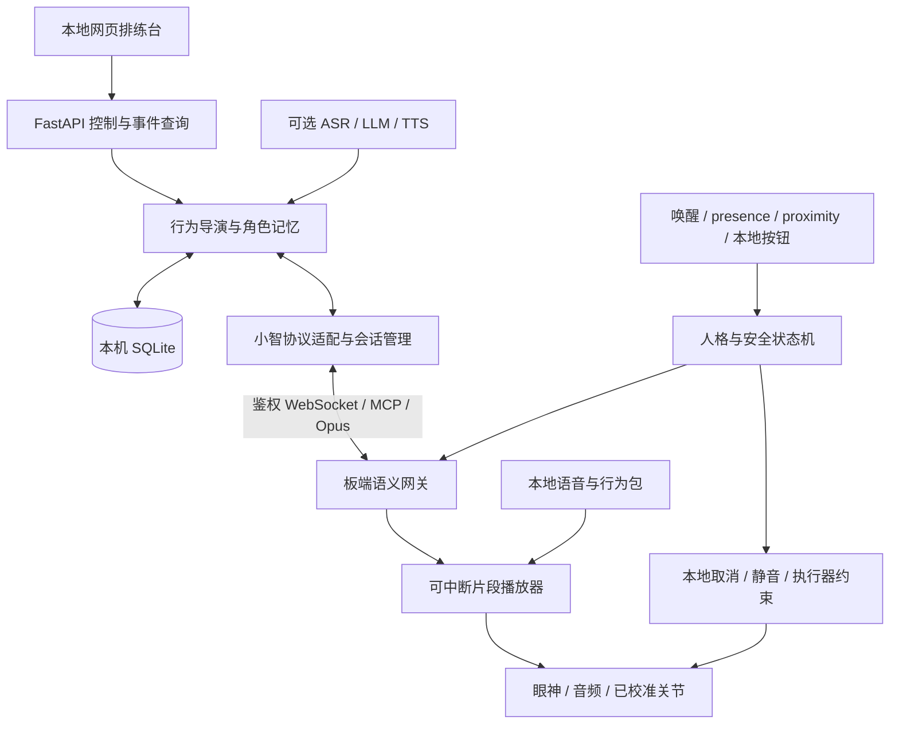

# 牛来工程 SPEC v2：生命感闭环、接口与开发标准

日期：2026-09-05｜状态：待实现的工程基线，不是功能已交付声明。

上游：[PRD v2](prd-niulai-life-v2-2026-09-05.md)。当前事实与分数：[审查报告](review-niulai-architecture-2026-09-05.md)。源码审查基准：`c636c9db07c0a5f84edfbedcf7dace5c15e3e243`。

## 1. 范围与当前差距

本规格针对一只固定放置、可表现眼神与关节动作的牛来原型。P0 必须真正发声、主动表演、记住经历、立即装乖，并在电脑断开时保持核心故事。位移运动与公开 IM 控制进入 P1。

当前可复用：FastAPI 模块化结构、10项模拟测试、意图 dataclass、受限 `niu.*` 文本解析器、三份外设测试源码。当前没有项目网页、持久化数据库、真实语音 Provider、完整设备协议或产品固件。`McpBroker.device_calls` 是内存记录，`im_outbox` 是测试发件箱；不能分别称作已执行动作或已发送消息。

## 2. 方案比较与选择

| 方案 | 优点 | 代价与适用条件 | 决策 |
|---|---|---|---|
| 单 S3＋本地 Python 大脑＋板端离线行为包 | 沿用当前工作，能快速调整台词与记忆，安全不依赖电脑 | 需完成板型移植、真实语音协议、本地取消与离线片段 | **P0采用** |
| 小智语音板＋ESP-Claw控制板 | 语音和执行器负载隔离 | 第二块板、电源、UART一致性和双固件测试工作增加 | 单板资源实测不足后再评估 |
| Linux SBC 统一语音与行为＋MCU安全控制 | 本地语音模型与复杂动画更自由 | 功耗、启动、散热、成本和运维增加 | 原型闭环完成后有明确性能需求再评估 |

以上是工程取舍，不是未经测量的性能结论。不要求某个品牌框架；替换实现时保持人格、协议、资源和验收合同。原09-01双板ADR关于物理拓扑不进入v2；其本地安全、旧结果失效、离线回退原则保留。原09-05单板路线保留，将最终人格裁决从电脑下沉到板端。

## 3. 组件与唯一权威



| 模块 | 拥有的状态／责任 | 不得承担的责任 |
|---|---|---|
| 板端 Persona＋Safety | 唯一正式人格、安全状态、epoch、传感新鲜度、执行许可 | 等待网络或数据库后才停止 |
| 板端 ScenePlayer与本地选择器 | 当前场景、资源、关节驱动；供当前演出使用的有限角色状态与本地候选选择 | 自行突破安全许可或解释模型任意代码 |
| 电脑 SessionManager | 单设备会话、取消任务、发送序列、协议适配 | 把自己的状态镜像当作板端状态 |
| 电脑 BehaviorDirector | 基于事实提出下一个场景，生成可选私密台词 | 直接发送角度、PWM或强制SECRET |
| MemoryStore | 经确认事件的持久账本及投影、电脑提案所需记忆镜像 | 把命令发送成功记成动作完成，或用旧镜像覆盖板端新经历 |
| 网页 | 显示遥测和请求结果，调整有限设置 | 越过后端直接驱动设备或缓存云端密钥 |

P0 一台本机、一个后端进程、一个设备会话。第二个设备或重复控制连接明确拒绝；不使用共享全局对象默默混合会话。无需微服务、消息中间件或向量检索。

## 4. 状态模型与抢占

### 4.1 三类状态

- `Presence = PRESENT | ABSENT | UNKNOWN`：带 `source`、板端单调观测时间、有效期。板端判断可信度，电脑不能覆盖真实传感结论。
- `Persona = MECHANICAL | SECRET`：唤醒响应是动作，不是第三种人格。移除产品路径中的 `PUBLIC_ALIVE`。
- `Safety = BOOT_SAFE | READY | SAFE_STOP | E_STOP_LATCHED`：启动自检后才能READY；急停锁存只能本地重新武装；清故障不自动恢复旧场景。

优先级：急停／严重故障 > 人在或未知／本地暂停 > 近障碍／低电量／动作过期 > 本地固定妈妈 > 本地场景 > 电脑场景 > 模型提案。安全态可以抑制妈妈；固定妈妈不授权运动。

`persona_epoch` 由板端递增：人格变化、强制取消、连接所有权切换均递增。`device_boot_id` 每次启动变化，不能只用会重置的 epoch 判断新旧。电脑重连后首先读取状态快照，清空旧任务和发送缓存。

### 4.2 转移规则

| 输入 | 处理 | 允许的输出 |
|---|---|---|
| 上电／传感失效／未收到有效presence | MECHANICAL＋BOOT_SAFE或SAFE_STOP | 已验证的静态表情；无自主运动 |
| 本地唤醒 | 作为PRESENT；epoch变化，取消SECRET；通过安全检查再回应 | 同一资产 `mama_001`，去重与冷却，禁止接模型续答 |
| 可信ABSENT持续8秒，且READY、无暂停 | 进入SECRET，重新选择当前适用场景 | 本地场景或经板端批准的电脑场景 |
| PRESENT／UNKNOWN | 立即MECHANICAL；清空所有私密播放和动作 | 静态机械姿态；无私密音频 |
| 近障碍／低电量 | 取消受影响动作，进入保守表现 | 不把障碍当成人；P0可选择保持机械态 |
| 普通断链 | 取消电脑场景，状态代次更新，静默观察至少2秒 | 可信ABSENT连续8秒且READY后仅本地场景 |
| 急停／本地暂停 | 取消声音及动作；急停锁存、暂停持续 | 不自动复活，需本地解除；网页无权解除急停 |

超声是 `proximity` 输入，只能证明一定方向的近障碍。距离大、无回波、NaN、过期数据不产生ABSENT。人员传感器需在实际布置中验证静坐、边缘区域、遮挡和多人返回。硬件未具备时只做 `source=operator_demo` 的人工排练；此来源永远不计入自动识人成绩。

### 4.3 取消的完整语义

板端取消一次必须完成：使当前许可失效 → 清动作计划及排队片段 → 停止私密音频与DMA待播缓冲 → 按已校准安全策略停止关节推进 → 记录取消原因 → 异步通知电脑。停止不等待日志、回执或机械复位动画。

区分“场景因条件变化被取消”和“操作者暂停整场表演”。网页暂停／`niu.stop`在板端设置 `paused=true` 并锁存，所有本地与电脑场景都停止排程；返回 `paused_confirmed` 后页面才显示已暂停。重连、无人稳定或新场景均不能清除此标记；仅本地按钮允许恢复。急停另有锁存，解除普通暂停不能解除急停。`paused`在重启后保留，或启动时保持暂停直至本地明确重新武装。

电脑收到代次变化或断开后，取消ASR/LLM/TTS请求及发送任务。即使远程服务不能取消，结果到达时也因旧会话／旧epoch被丢弃。所有入口——语音、网页、自主调度、未来IM——调用同一个意图入口，最终再由板端裁决。

停止命令与物理停稳分开：撤销新目标不等于关节没有惯性。保持、减速或去使能的策略按每个已装配轴校准，不能统一“断PWM”导致关节失去承托。用户可触及部位在完成夹持／限位检查前不得进入动态演示。

## 5. 行为导演与片段标准

### 5.1 最小角色状态

`mama_count`、`pending_complaint`、`recent_line_ids`（最多5条）、`interrupted_goal`（最多1个）、`mood`、`alone_since`、`last_completed_scene_id`。持久化范围见第8节；时间间隔只在当前单调时钟域内计算。

板端在真实事件发生时立即更新这组有限状态，负责离线因果连续性；SQLite保存已确认事件的持久投影，电脑据此提议场景。重连先上传未确认事件再合并投影，不用电脑旧快照覆盖板端新经历。板端掉电恢复只采用成功提交的本地快照与明确确认过的事实；不完整经历标为unknown。

不用复杂心理模型。初始情绪映射为 `curious=好奇 / relieved=松口气 / sheepish=心虚 / missing=想念 / sleepy=困倦`；嘴硬是共同的表演风格。选择优先顺序：合法的未完成目标 > 与刚发生事件有关的场景 > 与独处时长相符的场景 > 安静休息。候选在安全、冷却、频率、资源检查后再做带种子的加权选择。

板端ScenePlayer是唯一播放队列所有者。电脑有新提案时只能提交一个待执行场景；不并行运行第二个自主调度器。本地片段是默认内容；电脑提案超时或失效就继续选择本地内容。不得两边同时发起声音或驱动同一关节。

### 5.2 场景数据

一个场景描述动机和表演时间轴，最长8秒、最多16个cue、总JSON ≤8 KiB。每条cue引用打包资源和校准动作，不接受任意URL、脚本、硬件引脚或角度。

PRD的SC-04是跨时间的一个剧情类型，拆成两个独立短片段，由 `alone_since` 在合适时机调度。60–120秒等待属于调度器，不放进场景时间轴，也不占动作许可；验收场景去重按剧情类型计数。

```json
{
  "scene_id": "mama_quota_v1",
  "trigger_event_id": "device-boot7:103",
  "required_persona": "SECRET",
  "goal": "complain_after_three_calls",
  "duration_ms": 5200,
  "resume_policy": "replan_goal",
  "cues": [
    {"at_ms": 0, "track": "eyes", "asset": "look_left"},
    {"at_ms": 180, "track": "body", "asset": "small_glance_left"},
    {"at_ms": 750, "track": "eyes", "asset": "look_right"},
    {"at_ms": 950, "track": "body", "asset": "small_glance_right"},
    {"at_ms": 1600, "track": "voice", "asset": "quota_used_001"},
    {"at_ms": 3600, "track": "voice", "asset": "still_answer_001"}
  ]
}
```

语音资产manifest保存真实时长、情绪、音量归一化结果、校验hash。构建时检查同轨cue重叠、片段超时、缺失资源和非法姿态；上例时间为素材制作目标，真实音频必须按长度重新校验。场景开始取板端单调 `t0`，各轨按同一时间轴执行。

姿态过渡使用有限速度与平滑插值，眼神可领先头部100–250ms。渲染、解码和驱动不阻塞安全任务。被打断仅保存语义目标；下次重新选择cue与新许可，绝不接着执行旧毫秒位置的机械动作。

### 5.3 LLM边界

P0采用本地审核素材。P1模型只接收有限角色状态、当前可信事件和可用场景ID，输出 `line_text / emotion / suggested_scene_id`；最大24个汉字，枚举与长度校验，超时2秒使用本地素材。模型生成的事实声明必须能对应输入事件，不允许编造上次去过某处、看见某人或完成某动作。

在线生成语音只在SECRET且新鲜许可中准备；提前缓存完整短句后播放，以实际音频起点对齐表情。模型不生成可执行Lua。现有 `LuaSandbox` 是逐行受限调用解析器，不是真正Lua VM；v2逐步用可验证场景数据替代，保留旧测试作为迁移证据。

## 6. 真实语音与设备协议

### 6.1 小智适配边界

沿用设备 `/xiaozhi/v1/` 连接入口；明确 `sim` 与 `device` 两种启动配置，模拟模式只接受测试客户端、显示模拟标识，正式设备模式禁止 `mock-utf8`。

真实协议需包含协商hello、会话身份、Opus双向二进制音频、listen、tts、abort及MCP消息。官方WebSocket协议把音频二进制与JSON状态分开，发送 `tts start/stop` 不等于发出声音；v1二进制包是直接Opus内容。按固定的上游提交实现兼容测试，不宣称与未修改的任意小智固件通用。[官方协议](https://github.com/78/xiaozhi-esp32/blob/main/docs/websocket_zh.md)

核对日期2026-09-05，协议文档Git blob：`41e03d57c5d6cffc9bef66b5889d7f4598524681`。这只是文档内容标识，不是选定的固件版本；固件上游commit由M1实测后冻结。

P0固定妈妈由设备唤醒直接调用本地音频，避免ASR和网络时延。真实语音链路的验收可在明确标注的维护模式用一段录音完成ASR／回放，返回正式演示模式后仍必须遵守固定妈妈规则。

### 6.2 避免无标签音频越代播放

v1 Opus二进制没有自带 `persona_epoch`。本设计将一条秘密音频流绑定到一个连接代次：板端冻结、更换会话所有权、动作租约过期、显式停止或中途取消场景时，即使人格仍是SECRET，也立即停止解码、清DMA与音频队列，并关闭旧WebSocket；重连使用新 `session_id` 与当前状态。旧任务不得向新连接发送。重新握手期间只能本地表现，且仍受暂停、安全和无人稳定窗口约束。

上述失效规则同样覆盖任意epoch变化、换远端场景或从远端音频切到本地内容。每一帧二进制都检查当前连接代次、当前远端音频接收阶段和许可；非当前流直接丢弃，不能只在tts start检查一次。普通已完成的流确认排空后才能关闭接收阶段。测试必须覆盖“仍SECRET但租约过期→本地片段开始→旧Opus迟到”。

不能仅给 `tts start` 加epoch而任由旧二进制流继续播放。若后续改为带流ID的自定义音频封装，必须同时修改两端并独立验收，不能当作原版v1兼容行为。

### 6.3 语义动作合同

MCP标准外层承载工具调用，`niu.play_scene`、`niu.stop`、`niu.get_state` 是v2自定义工具，需在设备固件实现并做能力发现。下面是拟定的请求示例，不是当前已可调用API：

```json
{
  "type": "mcp",
  "session_id": "session-19",
  "payload": {
    "jsonrpc": "2.0",
    "id": 42,
    "method": "tools/call",
    "params": {
      "name": "niu.play_scene",
      "arguments": {
        "protocol_version": 1,
        "device_id": "niulai-01",
        "device_boot_id": "boot-7",
        "persona_epoch": 12,
        "command_id": "cmd-0042",
        "grant_id": "grant-91",
        "scene_id": "mama_quota_v1",
        "asset_bundle_hash": "sha256:<actual-bundle-hash>",
        "ttl_ms": 8000
      }
    }
  }
}
```

能力发现需返回协议版本、已校准动作、资源包hash。字段不匹配、资源缺失或设备不支持则拒绝，不静默换成近似动作。

| 字段／机制 | 约束 |
|---|---|
| 顶层JSON | 必须为对象；每种type使用严格schema；未知字段拒绝，数值必须有限且类型准确，布尔不得冒充整数 |
| command_id | 会话内唯一；板端缓存最近128个ID与结果；重发返回旧结果，不再执行 |
| boot＋session＋epoch | 任一不匹配拒绝；重启不能复用旧许可 |
| grant_id | 板端生成、绑定会话与epoch、单次消费、按板端单调时钟250ms后过期；每设备最多一个未消费grant |
| ttl_ms | `play_scene` 必须为1–8000整数；从板端接受时计执行期限；不能靠迟到包延长。grant先排除在网络中滞留的旧命令 |
| 参数范围 | 只接受资源ID与场景ID；拒绝 `pulse_us`、角度、任意URL、额外dir等字段；逐轨校准边界再次验证 |
| 动作租约 | 电脑场景每100ms续约，板端200ms未续约则取消；续约需当前boot/session/epoch/command，且不得延长8秒硬上限 |
| 停止 | 鉴权会话可请求；`niu.stop` 不因动作grant过期而拒绝，幂等并锁存paused；本地硬件停止不需要网络鉴权或grant |
| 回执 | RPC接受不是完成；后续事件有 `accepted/started/completed/cancelled/rejected`、原因、板端时间与事件序列 |
| 回执超时 | 500ms未收到接受结果，主机标为不确定并查询；不能用新ID盲目重发；始终受板端租约约束 |

动作续约是短期活性信号，不允许盲目连续刷入未来运动。对取消、重复ID、过期grant分别测试。P1若开放 `walk/turn`，必须另加方向、速度、时长、运动区域和位移限制；v2 P0不暴露它们。

状态／动作事件通过自定义 `type=custom`、`namespace=niulai.v1` 帧传回，固定 `device_id/device_boot_id/event_seq/event_id/epoch/memory_generation/kind/payload/device_mono_ms`。`memory_generation`在事件产生时写入，重发不得改为当前值。这是需要两端实现的扩展；主机收至SQLite提交成功后ACK事件序列，用于可靠记忆，不能用于恢复旧控制命令。缺失generation事件不参与持久记忆；清空确认返回新generation后才能恢复历史相关场景。

同一custom命名空间补足控制流程，不另建传输通道：

| 消息kind／方向 | 必填内容与处理 |
|---|---|
| `state_snapshot` 板→电脑 | boot/session/epoch/memory_generation、persona、safety、paused、current_command、device_mono_ms；握手后立即发送，此后每500ms一次；不生成grant、不递增epoch、不续租 |
| `grant_request` 电脑→板 | request_id、当前boot/session/epoch、scene_id；仅在快照已确认且READY／SECRET／未暂停时申请 |
| `grant_response` 板→电脑 | request_id、grant_id、当前epoch、有效250ms；或rejected及reason；新的grant使同设备旧grant失效 |
| `lease_renew` 电脑→板 | boot/session/epoch/command_id、严格递增renew_seq；仅针对已接受当前场景；重复seq不刷新期限，不缓存未来续租 |
| `lease_status` 板→电脑 | command_id、最近有效renew_seq、accepted/rejected与reason；主机若500ms未见有效状态标记失联，不推测仍在运动 |
| `event_ack` 电脑→板 | boot_id、最高连续已提交event_seq、memory_generation；有缺口不跳过ACK，按事件ID重发去重 |
| `memory_reset` 电脑→板 | request_id、新generation；在已确认暂停后清除本地语义缓存并持久化新generation；同请求幂等 |
| `memory_reset_ack` 板→电脑 | request_id、新generation、cleared/failed及reason；电脑据此完成清空状态 |

拒绝原因至少区分 `bad-schema/stale-session/stale-epoch/expired-grant/unsupported-asset/paused/not-safe`。续租有效性用板端接收时刻和仍未过期的租约判断，租约到期后再来的续约不能使动作复活。遥测快照保证安静期间也能判断连接新鲜度。

### 6.4 资源与并发限制

初始工程预算：每设备1个有效连接、1个正在运行场景、最多1个待执行场景、1个生成任务。JSON上限8KiB、单音频帧上限8KiB、单次录音最多15秒或512KiB（先到为准），超出立即结束当轮并清理缓冲。实际Opus参数与设备RAM经M1测量调整，不能靠无界队列遮掩卡顿。

电脑使用异步I/O，阻塞ASR/解码/SQLite操作移出WebSocket事件循环。每连接有独立接收、发送与取消生命周期；同一连接的发送经单队列顺序执行，断开后所有任务回收。错误JSON类型、二进制乱序、未hello发送listen、无start的stop均得到受控错误。

## 7. 前端开发标准

推荐由FastAPI同源提供一页HTML/CSS/JavaScript，接口先定型；当前范围不需要独立前端框架和构建服务。若后续页面复杂度证明需要React/Vue等，再替换，以下验收不变。

### 7.1 页面与接口

```text
牛来 · 已连接 / 离线 / 模拟输入                 [暂停表演]
现在：机械 / 偷偷活动 / 已暂停      最近反馈：设备已取消
当前场景：刚才想到哪儿             音量 [--●---]
事件时间轴：唤醒 → 妈妈播放完成 → 确认无人 → 场景开始
角色记忆：[展开]                   [导出本次记录]
高级排练：[展开，模拟事件有常驻标识]
```

| 拟定接口 | 作用与语义 |
|---|---|
| `GET /api/v1/state` | 当前连接、板端快照、遥测年龄、persona、safety、场景、模式；无快照则unknown |
| `GET /api/v1/events?cursor=&limit=` | 增量查询；默认50最多200；断线后按cursor补齐，禁止无限返回 |
| `POST /api/v1/control/stop` | 返回202与request_id；设备取消事件到达才标记已取消；网页不宣称物理已停稳 |
| `PATCH /api/v1/settings` | 仅音量0–100与暂停请求；有效值需设备确认；不能远程解除急停 |
| `GET /api/v1/memory` | 返回有限计数与语义记忆，不返回原始录音 |
| `DELETE /api/v1/memory` | 明确确认清空后生效；同时清电脑与设备语义缓存，生成新memory_generation |
| `POST /api/v1/rehearsal/events` | 仅sim或本地维护模式；禁止覆盖实机传感事件；标记不计验收 |

网页每500ms拉取轻量快照，1秒刷新事件；状态超过2秒未更新显示失联／陈旧，不能继续显示实时绿色状态。简单轮询足够首版，不另造第二套控制WebSocket。

### 7.2 五项合格标准

| 编号 | 标准 | 验证 |
|---|---|---|
| FE-1 状态真实 | 在线、陈旧、断线、模拟、拒绝、等待、完成全部可分辨 | 断网／延迟／拒绝注入，截图与API事件对照 |
| FE-2 控制闭环 | 重复点击只产生一个逻辑请求；按钮以设备事件更新；离线停止明确提示本地按钮 | 连点、超时、重连回放 |
| FE-3 可用性 | 360px与1366px无主要横向滚动；主按钮至少44px；键盘可达；有焦点样式和文字标签 | 浏览器人工验收，键盘全流程 |
| FE-4 数据与权限 | 同源会话、CSRF防护、授权后控制；不把文本作为HTML注入；无密钥进入页面 | 负例请求与脚本内容渲染检查 |
| FE-5 性能与恢复 | 本机目标首屏≤2秒；断线2秒内提示；事件列表最多500条，旧记录分页 | 首屏测量、长时运行与重连 |

键盘、焦点、对比度、触控目标参考WCAG 2.2。44px是项目主动采用的目标，不宣称它等于WCAG所有AA要求；本轮也不宣称整站无障碍认证。[W3C WCAG 2.2](https://www.w3.org/TR/WCAG22/)

## 8. 数据库与记忆开发标准

采用本机SQLite文件，先保持默认rollback journal，单写入工作线程与短事务即可。数据库放在本机磁盘，路径配置化；密钥在环境／系统凭据存储，数据库与录音不提交Git。数据库服务或向量库不是必要条件。

### 8.1 最小表结构合同

| 表 | 关键字段、约束与索引 | 用途 |
|---|---|---|
| `schema_migrations` | `version`主键、`applied_at`、`checksum` | 顺序迁移与版本校验 |
| `device_events` | `event_id`主键；`device_id, boot_id, event_seq`唯一；`memory_generation, kind, epoch, device_mono_ms, received_at, payload_json`；索引`(device_id,received_at)` | 保存真实唤醒、开始、完成、取消事实；payload≤4KiB |
| `character_state` | `device_id`主键；`memory_generation, mama_count, pending_complaint, recent_line_ids_json, interrupted_goal_json, mood, last_event_id, updated_at` | 有限角色状态；计数非负，近期台词≤5、目标≤1 |
| `scene_runs` | `run_id`主键；`device_id, boot_id, command_id`唯一；`trigger_event_id`外键；`scene_id, epoch, status, reason, started_at, ended_at` | 区分请求、开始、完成、取消；不保存可重放运动队列 |

用参数化SQL、外键与CHECK约束，连接建立时启用foreign_keys。场景定义和媒体manifest是版本化文件，不复制成第四套内容管理系统。

### 8.2 一致性与掉电

一次事件事务执行：插入 `device_events`（重复则不重复投影）→更新 `character_state` →更新对应 `scene_runs` →提交→向设备ACK。妈妈次数以 `mama_001` 唯一播放完成事件计数；唤醒被冷却、拒绝或播放被中断都不增加妈妈次数。唤醒事件另行保留，不混淆被叫次数与完整回应次数。“说过某句”以实际播放开始事件记录；“完成某事”只能由completed事件产生。

电脑已提交但ACK丢失时，设备重发同一event_id，唯一约束保证不重复。电脑发出命令但未收到执行结果时保持unknown，不推测completed。进程重启恢复已提交的语义记忆，所有未结束run标为interrupted／unknown；无论数据库状态如何，设备上电都不重放旧运动。

板端为离线事件维护有界缓冲，初始上限128条；低频语义事件以校验和和双槽快照保存，禁止每帧写Flash。具体NVS/文件方案、写入频率和耐久需在板型冻结后验证。缓冲溢出记录gap，恢复后标记经历不完整，不能补编缺失事件或宣称精确计数。不能证明持久写成功的离线事件标为易失，不承诺掉电恢复。

数据存储失败不阻塞停止：进入 `memory_degraded`，本体可做无历史依赖的安全场景；暂停会声称“记得上次”的内容。恢复后同步事件并按事务重建状态。

### 8.3 留存与清空

原始麦克风音频仅在有界当轮内存，结束／取消即清理，不落盘。默认不存完整ASR文字；只保留驱动剧情的有限事件。P0事件与运行记录默认保留7天、总量上限10000条，达到任一边界按最旧裁剪；当前未结束记录保留至终态。裁剪相关外键一致处理，不能留下破损引用。

用户清空记忆时：在线设备先确认暂停，电脑事务删除语义事件与角色状态并增加 `memory_generation`，通过memory_reset通知设备清缓存并确认；设备离线时先完成电脑侧清空，显示“电脑已清空，设备待暂停与清空”，禁止电脑侧历史引用，不声称远端本体已暂停或已删除记忆。重连先读取快照，要求设备暂停并完成memory_reset，不消费其旧generation事件。旧generation事件不得重打新标签或重新写入新记忆。备份一并删除或标明仍含旧数据，删除失败明确显示；不许把旧备份恢复成新的空记忆。

### 8.4 五项合格标准

| 编号 | 标准 | 验证 |
|---|---|---|
| DB-1 建模／迁移 | 类型、唯一键、外键、版本迁移可检查 | 从空库与上一版样例迁移；非法数据被拒绝 |
| DB-2 事务／幂等 | 一个真实事件只影响状态一次，失败无半条投影 | 20次重复＋在提交前后终止进程 |
| DB-3 记忆真实性 | 想做、开始、完成、取消分开；重启不续旧运动 | 打断／重启／ACK丢失回放 |
| DB-4 留存／隐私 | 有界保存、原始音频不落盘、清空不被离线旧事件复活 | 超量裁剪、断线清空、旧generation重发 |
| DB-5 恢复／性能 | 本机事件事务p95≤50ms；备份可恢复；损坏／磁盘满明确降级 | 10000事件样例、故障注入、临时目录备份恢复 |

SQLite运行时与Python依赖一同记录和锁定。若以后切换WAL，必须额外检查同机文件系统、checkpoint、备份一致性和已修复版本；官方说明WAL依赖同机共享内存，且记录了2026年的WAL-reset修复。本方案不为未测的并发需求提前启用WAL。[SQLite WAL文档](https://www.sqlite.org/wal.html)

## 9. 后端开发标准

| 编号 | 标准 | 验证 |
|---|---|---|
| BE-1 真实协议 | sim与device显式区分；真实Opus／MCP能力发现；无mock冒充正常 | 固定音频样例＋目标板往返录音、抓取非私密时序 |
| BE-2 统一意图 | 语音、网页、自主、未来IM经过同一仲裁；以设备epoch为准 | 同一输入跨入口对照；冻结时0私密输出 |
| BE-3 取消／并发 | 每连接任务有创建和回收；单写队列；生成超时不拖住收事件 | 慢Provider、断连、旧结果、双连接负例 |
| BE-4 动作生命周期 | 严格schema、限时许可、去重、开始／结束回执 | 重复、乱序、过期、未知参数和丢ACK矩阵 |
| BE-5 容量／可观测 | 有界录音与队列；带event_id/run_id的日志；health不冒充设备ready | 超限输入、30分钟运行、指标与真实设备对照 |

运行方式保留Python模块化单体。新增文件按职责逐步出现，如 `session.py`、`director.py`、`memory.py`、`schemas.py`；不为了目录整齐先重构所有现有代码。Provider只定义本次需要的transcribe／generate_line／synthesize接口。

依赖固定到经过验证的具体版本并保存锁定文件；当前只有`>=`的requirements不足以证明可复现。先保留10项现有测试，再加入能击中审查发现的回归；不以函数行数或测试数量单独评判质量。

## 10. 嵌入式开发标准

正式固件以实际小智板型为基础建立单一产品目标，保留三份Arduino台架程序供排障，不能直接将其自动扫轴loop并入产品。

| 编号 | 标准 | 验证 |
|---|---|---|
| FW-1 可复现与校准 | 固定板型、芯片配置、工具链、依赖、引脚、资源版本；每轴限位／方向／速度／保持策略有实测 | 干净构建；逐轴台架记录；固件与资产hash |
| FW-2 可中断调度 | 安全检查目标周期≤10ms；动作分步、音频分块；无900ms动作阻塞 | 播音＋屏幕刷新＋动作满载时记录最大调度间隔 |
| FW-3 本地安全 | 本地persona/safety、静音、租约、急停；断电脑仍有效 | PRD AC-02／03／07，脱离调试器独立运行 |
| FW-4 协议执行 | 接收端再校验schema／版本／epoch／grant／资源，真实回执 | 旧包、超长包、同ID重发、过期续租、重启注入 |
| FW-5 完整表现与可靠性 | 本地妈妈、3个场景、三轨同步、启动安全、故障恢复 | 10场演出＋30分钟＋断电重启；物理停稳另测 |

任务划分初始建议：高优先级Safety与感知事件，中优先级关节／音频时序，低优先级网络、屏幕非关键刷新与日志。优先级、核心亲和性、栈大小通过实际负载测量决定，不预设双核就能解决阻塞。

采用ESP-IDF的任务／中断看门狗作为失控恢复保障，动作租约负责更短的执行期限。硬件看门狗不是人格取消机制。官方文档说明调试环境可能改变看门狗行为，因此时延和故障验收要包含脱离JTAG的独立运行；使用的ESP-IDF版本必须与选定小智提交兼容，不因stable文档已更新就强行升级。[Espressif看门狗文档](https://docs.espressif.com/projects/esp-idf/en/stable/esp32s3/api-reference/system/wdts.html)

实测资源表必须包含空闲／播放／同时动作时CPU、最小空闲堆、最大连续空闲块、各任务栈最低余量、Flash资产占用、供电峰值与温升。目标为最差场景仍留≥20%的计划内RAM预算，且能满足最大解码分配；具体阈值需按板型确认。不能用16MB Flash／8MB PSRAM标称值代替测量。

## 11. 安全与访问开发标准

| 编号 | 标准 | 验证 |
|---|---|---|
| SEC-1 能力最小化 | 模型／场景不能携带硬件参数或任意脚本；板端白名单 | 拒绝pulse_us、非法资源ID、超长TTL、未授权动作 |
| SEC-2 来源与权限 | 设备配对凭据，网页会话鉴权，Origin／CSRF检查；同一设备仅一个控制会话 | 无凭据、跨站、错误设备、重复连接负例 |
| SEC-3 容量与重放 | 消息／录音／队列有上限，ID去重、grant与epoch防重放 | 超限、旧包、同ID、旧会话批量注入 |
| SEC-4 隐私 | 原始音频不落盘；模型上下文最小；日志与页面无密钥；记忆可清空 | 日志检查、磁盘检查、离线重连清空测试 |
| SEC-5 物理失败安全 | 断网、超时、未知感知、急停由板端处理 | 真机故障注入，不用Web测试替代 |

默认管理页面仅回环监听；设备访问按实际局域网接口单独配置。正式设备连接使用TLS与设备凭据，验证服务器身份；凭据不放URL。可保留明确标记的隔离开发ws模式，但不能据此声称已达到网络安全门槛。公网暴露不是P0必要条件。

现有IM回调在正式演示配置中默认关闭。重新启用前按平台官方规范完成签名／token、事件类型、发送者授权、事件ID去重与回复回执；本次不代发消息、不修改平台设置。安全控制参考OWASP ASVS 5.0.0的验证思路，采用项目适用项；未进行完整ASVS合规评估。[OWASP ASVS](https://owasp.org/www-project-application-security-verification-standard/)

## 12. 测试与评分的统一标准

### 12.1 证据等级与评分

每个维度5项，每项0–4分：0无实现或无可核验证据；1有片段／mock／台架代码；2目标软件内完成集成自动验证；3目标设备或目标运行环境通过验收；4重复量化验收并覆盖故障。纯文档不能给实现项加分。主观体验项3／4级必须有真实观察记录。

维度分=`五项之和÷20×100`。权重：生命体验25%、Web前端10%、后端15%、数据库10%、嵌入式20%、安全10%、测试5%、架构5%。权重合计100%，本轮固定；每次复评使用相同标准与新增证据。当前细项与总分见审查报告，不因写完本SPEC自动涨分。

演示合格门槛：总分≥75；所有维度≥60；生命体验、嵌入式、安全各≥80；PRD全部P0验收通过。任何真实安全抢占失败、错误进入秘密态、私密音频泄漏、未鉴权控制或旧运动重放都是阻塞项，即使总分很高也不通过。小样本通过不等于量产认证。

体验五项：人格一致、自主因果、声音眼神身体协同、记忆连续、陌生观众理解。测试五项：可重复基础回归、负例与故障、真机验收、构建版本证据、持续回归自动化。架构五项：职责边界、契约明确、实现复杂度适当、唯一状态权威、可追踪与演进。

### 12.2 从当前代码开始的测试清单

| ID | 需要新增的关键测试 | 成功条件 |
|---|---|---|
| T-01 | FREEZE／MECHANICAL下语音、网页、IM请求 | 不能出现私密台词；真正唤醒走本地妈妈；禁止动作 |
| T-02 | 传感未知、远距离超声、无回波、断开 | 不能变成ABSENT；可信无人稳定8秒后才能SECRET |
| T-03 | 无用户输入且保持可信无人，推进虚拟时钟 | 发生多个有条件场景；不能靠重新hello触发 |
| T-04 | 严格schema与动作参数负例 | `[]`、null、NaN、额外pulse_us、TTL超大／布尔、缺失字段都受控拒绝 |
| T-05 | 取消发生在生成、排队、解码、执行阶段 | 各阶段都不泄漏旧结果；新连接不接旧音频 |
| T-06 | grant过期、epoch变化、重复ID、重连 | 旧动作执行0次；重复返回同结果；重连从快照开始 |
| T-07 | SQLite提交前后崩溃、重复事件、清空后旧事件 | 无双倍计数、无半投影、无旧记忆复活 |
| T-08 | 真实音频与板端执行器 | 真正录到声音，取得started／completed／cancelled与实物证据 |
| T-09 | 断电脑、传感拔出、供电重启、看门狗 | 本地安全持续成立；不恢复旧运动；有明确恢复路径 |
| T-10 | 排练台及陌生观众 | 状态真实、无模拟成绩污染，按PRD AC-09／10记录 |

虚拟时钟用于无人窗口与冷却测试；硬件时序用逻辑分析／示波器或经校准录像记录。命令起止、电机物理停稳、扬声器实际静音分别测量。p95和最大值同时报告，不能删掉慢样本；各设备时钟若没同步就不能直接相减。

### 12.3 验收记录格式

```json
{
  "run_id": "acceptance-20260905-example",
  "requirement_id": "AC-03",
  "environment": "HIL",
  "source_commit": "<commit>",
  "firmware_hash": "<hash>",
  "asset_bundle_hash": "<hash>",
  "device_profile": "<verified-board-and-calibration>",
  "attempts": 100,
  "passed": 0,
  "failed": 0,
  "not_run": 100,
  "evidence_paths": [],
  "status": "NOT_RUN"
}
```

这是待执行模板，不能把占位数据当结果。实际记录必须满足attempts=passed+failed+not_run；模拟、SIL（软件在环）、HIL（硬件在环）、观众测试分开统计。

## 13. 实施迁移与完成门禁

| 顺序 | 对应当前文件／模块 | 改动目标 | 退出证据 |
|---|---|---|---|
| M0.1 | `brain/app/main.py`、`brain.py`、`persona.py` | 统一入口，修复绕过，取消PUBLIC_ALIVE语义 | T-01／02，原10项按新产品语义更新并说明 |
| M0.2 | `models.py`、`mcp_broker.py`、`im.py` | 严格schema、身份、动作生命周期；正式模式关闭未验证IM | T-04／06，无pulse_us穿透 |
| M1.1 | 正式小智板型；保留现有`firmware/*-test` | 引脚与资源确认，本地妈妈／Safety／可取消关节 | 干净构建、台架、真声音与AC-03 |
| M1.2 | 真实协议适配与板端网关 | Opus／MCP／状态镜像／连接代次隔离 | T-05／06／08 |
| M2.1 | 片段播放器、本地素材、BehaviorDirector | 至少3种持续自主场景，三轨同步与离线兜底 | AC-04／05／07 |
| M2.2 | MemoryStore、设备事件缓冲 | 事件事务与有限记忆、重启和清空 | T-07、AC-06 |
| M3 | 单页Web、版本化验收记录 | 排练、故障复现、陌生观众测评 | AC-08／09／10及评分门槛 |

本轮文档工作不修改现有功能代码、不烧录、不推动实物动作。未来烧录前应核对目标板和串口、保存原固件／可恢复来源、确认引脚与供电；这份设计文档不是对未知设备烧录的授权。

每项开发提交应附“需求ID、改变的行为、验证结果、仍未验证部分”。协议变更先改schema和兼容测试；人物规则变更先改PRD和全部入口测试；硬件映射变更先改设备清单与逐轴校准。保持变更能追溯到一个已确认需求。

## 14. M1必须冻结的设备清单

| 项目 | 当前状态 | 冻结要求 |
|---|---|---|
| 实际S3板型、Flash／PSRAM配置 | 本轮未核对实物 | 照片／丝印、配置、可复现构建 |
| 麦克风、Codec／功放、扬声器、静音脚 | 只有测试源码线索 | 官方规格与接线、录放音、取消测量 |
| 每个执行器及机构 | 有统一PWM台架草图 | 型号、方向、限位、速度、启动姿态与停止策略实测 |
| presence硬件与场地 | 只有超声相关代码 | 可信三态、覆盖区与AC-02；缺失则只人工排练 |
| 电源与线束 | 本轮未复测 | 最大负载电流、电压跌落、温升、共地与信号电平 |
| 工具链与上游commit | 当前产品固件未固定 | 选定小智提交、兼容IDF、依赖锁、完整构建日志 |

这些未知项限制的是实机完成声明，不阻止先完成软件负例、协议模拟和资源设计。达到任一新门槛后，用新证据更新审查表，再继续下一阶段。
